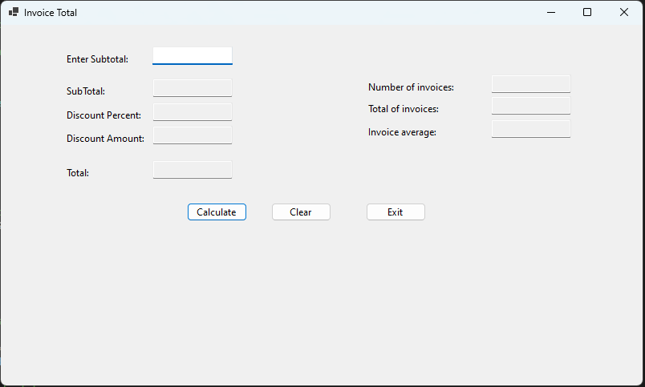

# Invoce Total Windows Form App
>A windows form app to calculate invoice total.

## Table of contents
* [General info](#general-info)
* [Screenshots](#screenshots)
* [Technologies](#technologies)
* [Setup](#setup)
* [Features](#features)
* [Status](#status)
* [Inspiration](#inspiration)
* [Contact](#contact)

## General info
The goal of this project is to show my portifolio to the world.

## Screenshots

## Technologies
* 

## Setup
* 

## Features
Features ready:
*

To-do list:
* None

## Status
Project is: _finished_

## Inspiration
Project based on C# I read.

## Contact
Created by Julius Mushi - feel free to contact me!
